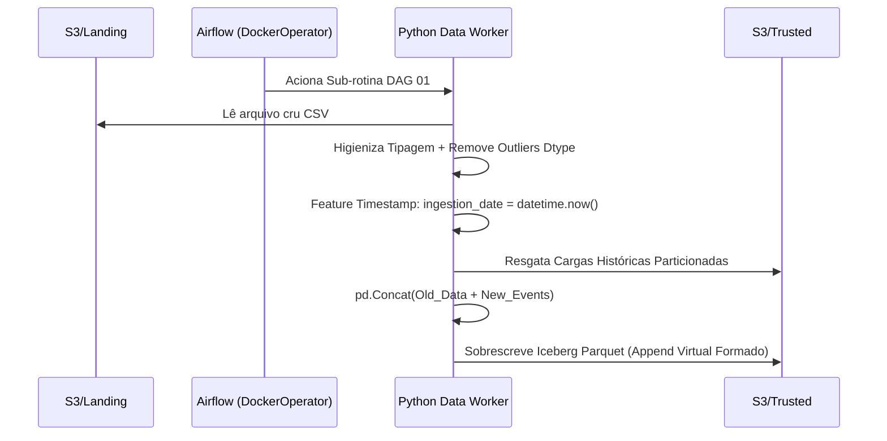
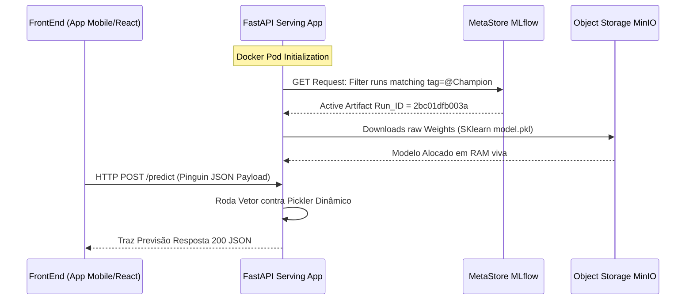
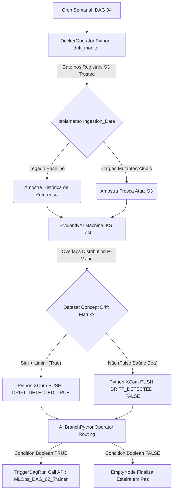

# 🚀 Self-Healing MLOps Platform (End-to-End)

Uma plataforma de Machine Learning Operations de nível corporativo, projetada em arquitetura de microsserviços, 100% conteinerizada (Docker), orientada a Data Contracts (YAML) e blindada por sistemas de Auto-Cura (Self-Healing) contra Data/Concept Drift.

---

## 🛠️ Como Iniciar a Aplicação (Bootstrapping)

A arquitetura foi inteiramente orquestrada via **Docker Compose** nativo em Linux. Para subir o laboratório isolado na sua máquina sem instalar nenhuma dependência sistêmica fora do Docker Engine:

1. Clone o repositório e navegue até o diretório da Pipeline:
```bash
git clone https://github.com/engfelipeviana/machine_Learning_pipeline.git
cd machine_Learning_pipeline
```

2. Inicialize a Nuvem da Infraestrutura e Build workers isolados:
```bash
# Sobe os containers de rede raiz, bancos (PostgreSQL, MinIO), Plataformas (Airflow, MLflow) e APIs (FastAPI)
docker compose up -d

# Builda localmente as Imagens Master para os Workers Analíticos e de Computação do Airflow
docker compose build builder-data-worker
docker compose build builder-mlops-worker
```

3. Acesse os *Endpoints* Essenciais via localhost:
- **Apache Airflow (Orquestrador UI):** [http://localhost:8088](http://localhost:8088) *(admin / admin)*
- **MinIO S3 (Data Lake Console):** [http://localhost:9001](http://localhost:9001) *(minioadmin / minioadmin)*
- **MLflow (Model Registry):** [http://localhost:5000](http://localhost:5000)
- **FastAPI (Inference Swagger UI):** [http://localhost:8000/docs](http://localhost:8000/docs)
- **Trino / JupyterLab:** [http://localhost:8888](http://localhost:8888)

---

## 🏛️ Arquitetura Macro da Solução

O ecossistema divide-se em Ingestão Medallion, Orquestração Docker-in-Docker (DinD), Registro Científico Controlado e Consumo API de Baixa Latência. A Máquina Airflow lidera a auto-manutenção da Inteligência Artificial.


---

## 🧩 Componentes da Arquitetura em Detalhes

### 1. Data Engineering (Pipeline ELT Medallion)
A ingestão de dados atua sobre o modelo de camadas lógicas (Medallion Architecture) persistindo DataFrames físicos no S3, rastreados matematicamente via Particionamento Temporal.

- **Fluxo Lógico:** O arquivo sujo de eventos chega na `Landing Zone` cru. A Airflow (DAG 01) invoca um container Docker puro (*Data Worker*) que higieniza e converte o dado para Parquet (`Raw Zone`). No último salto, uma coluna sistêmica temporal `ingestion_date` é aplicada e o Delta/Data Append é soldado sobre os arquivos legados da camada central `Trusted Zone`.
- **Norte Estratégico:** Fornecer massas de dados governadas limpas pro time de Dados rodar Feature Engineering e Consultas ANSI SQL Pesadas sem sobrecarregar Bancos Transacionais, entregando aos Cientistas de MLOps blocos padronizados de Inteligência Artificial.



### 2. Contract-Driven ML Training (Orquestração DinD)
A pipeline defende e erradica o risco de Código Rígido do Cientista rodando local em laboratório. Todo o Treino é abstraído por Variáveis em um Arquivo passivo Genérico. Todo Treino roda em ambientes sub-virtuais isolados e que sofrem Auto-Destruição assim que finalizados.

- **Fluxo Lógico:** A Airflow (DAG 02) lê por S3fs o arquivo `penguins_contract.yaml`. O processo chama um *Socket do Docker da Máquina Servidora (DinD)* pedindo pra levantar temporariamente a imagem Ubuntu `worker-mlops`. Variáveis do Contrato (Features Categórica, Caminhos) são enjetadas nas ENVs. Ele treina o Modelo Scikit Pipeline robusto local e aciona client nativo do MLflow. O binário `.pkl` sobe criptografado ao repositório unificado.
- **Norte Estratégico:** Viabilizar escalabilidade. Ambientes Orquestradores Limpos. Pra testar Redes Neurais vs XGBoost num modelo novo, muda-se o contrato YAML de `60 linhas` sem ter que refatorar os Pythons base.

```mermaid
graph LR
    YAML[penguins_contract.yaml S3] -->|Airflow Parser| DIND[DockerOperator Socket]
    DIND -->|Spawn Isolate Session| MWO[Ubuntu worker-mlops]
    MWO -->|Fetches Train Slice| Data[(Trusted Delta Sets)]
    MWO -->|Scikit-Learn Model.Fit()| Artifact[(Cerebro Pickle_Binary)]
    Artifact --> MLflow[Logger MLflow Tracking API]
    MLflow --> S3Bucket[(MLflow Artifacts Store)]
```

### 3. Model Serving (FastAPI Real Time)
A fronteira da MLOps não termina onde o Treino acaba, mas como ele é Exposto como Produto Global pro Ecossistema.
- **Fluxo Lógico:** Um Servidor ASGI `FastAPI` inicia atrelando a um evento raiz `Lifespan`. Imediatamente, ele acessa o Banco Log SQL Postgre do MLflow por API para caçar via string Tag "Qual é a versão atual marcada como @Champion do Time?". Após deduzir o Hash Key dele próprio, o Endpoiny baixa o Parquet das lógicas treináveis (Features Scale rules) pra dentro da Memória RAM da máquina App. Os Routes abrem as postas.
- **Norte Estratégico:** Entrega com Latência Baixa HTTP JSON ao Frontend/Mobiles/VueJS e tolerância a quedas via Inversão Computacional de Despacho (O Cérebro S3 preenche o Modelo Local Instantaneamente na inicialização do serviço Cloud).



### 4. Observabilidade Estocástica (Self-Healing MLOps)
O Guardião Definitivo e o propósito Central Operacional de ML Engineers (A Fama da Fase 8): Garantir que Modelos envelheçam ativamente ou morram ao detectar Model Decay de maneira preemptiva. 

- **Fluxo Lógico:** A Airflow (DAG 04 cronjob @weekly) roda silenciosamente pelo evidentemente (`EvidentlyAI`). Recortando magicamente as "Geracoes Passadas Ouro (Ano 2000 Base)" da Janela Recente do Lake "Geração Nova Corrompida (2026)".
As métricas Kolmogorov-Smirnov/Wasserstein cruzam as matrizes e verificam desvios de *P-value>0.05*. Se simétrica ou anomalias explodem à marca de 50%, a Matemática dispara True de Regressão. A DAG 04 lança um Branch Booleano desviando o fluxo do *end_monitor* pra Acionar o Gatilho Direto de Auto-Cura. O Airflow desce a API pra Dag 02 e Roda Retreinando a Placa Neural na Base Modificada automaticamente.
- **Norte Estratégico:** Governança Imutável. Ninguém treina modelos pra testes frívolos. É a Matéria ditando o ritmo Evolutivo do software, tirando carga cerebral cara de Cientistas para ficarem rastreando Desempenho. Custos Caem, Performance é Self-Driving.


