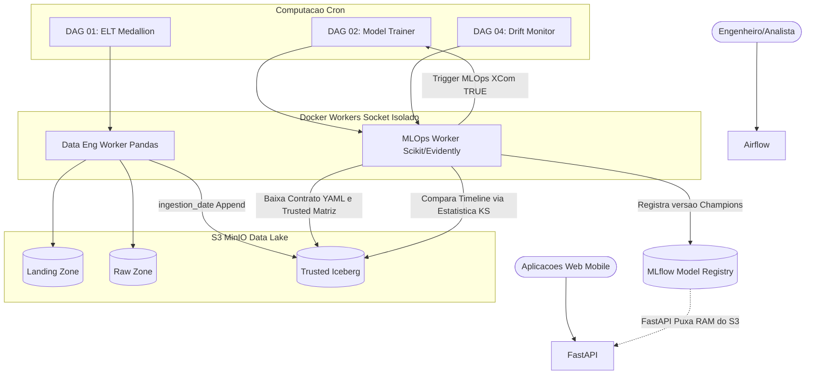
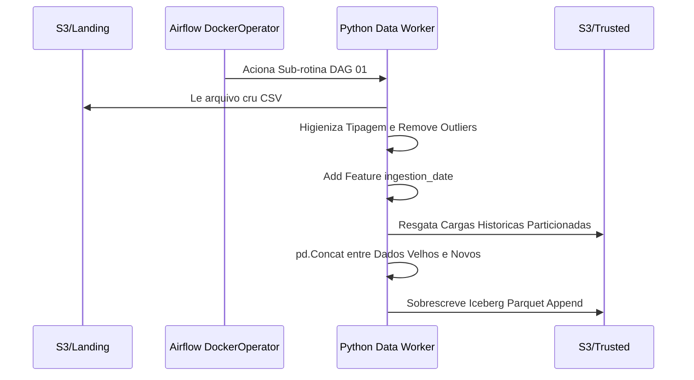
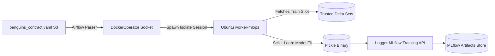
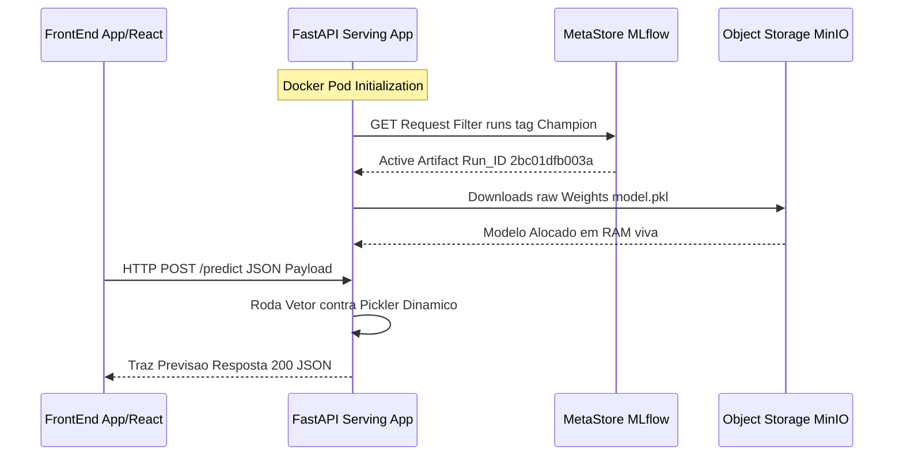
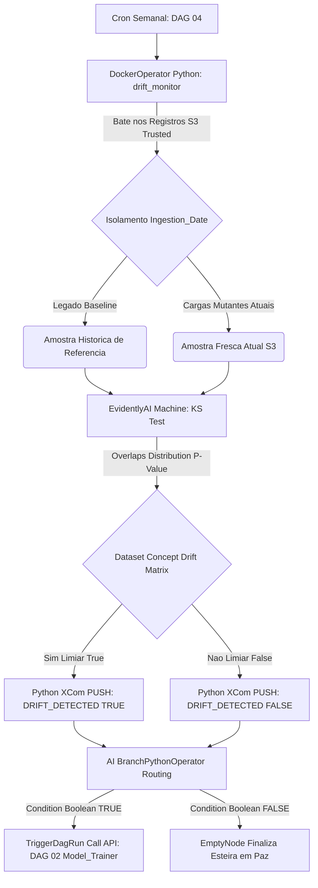

# Self-Healing MLOps Platform (End-to-End)

Uma plataforma de Machine Learning Operations de nível corporativo, projetada em arquitetura de microsserviços, 100% conteinerizada (Docker), orientada a Data Contracts (YAML) e blindada por sistemas de Auto-Cura (Self-Healing) contra Data/Concept Drift.

---

## Como Iniciar a Aplicacao (Bootstrapping)

A arquitetura foi inteiramente orquestrada via Docker Compose nativo em Linux. Para subir o laboratório isolado na sua máquina sem instalar nenhuma dependência sistêmica fora do Docker Engine:

1. Clone o repositório e navegue até o diretório da Pipeline:
```bash
git clone https://github.com/engfelipeviana/machine_Learning_pipeline.git
cd machine_Learning_pipeline
```

2. Inicialize a Infraestrutura e Automatize o Boot (Recomendado via Makefile):
O repositório possui um `Makefile` configurado para automatizar builds local de workers Airflow DinD, inicializar o banco e logar automaticamente. No terminal da raiz, execute apenas:
```bash
make start
```
*Isso irá construir internamente as Imagens Master, subir a Nuvem (Comando equivalente a `docker compose up -d`) e, após 15 segundos de aquecimento, **abrirá automaticamente todas as URLs abaixo no seu navegador padrão de abas!***

Caso prefira o uso fragmentado para gerência manual, o `Makefile` oferece comandos individuais:
- `make build`: Efetua apenas a construção das imagens.
- `make up`: Apenas sobe os containers silenciados do ecossistema.
- `make down`: Desliga ordenamente todo o cluster containerizado.
- `make clean`: Destrói todo o cluster e limpa rigorosamente volumes residuais.

3. Endpoints Essenciais (Abertos na Tela pelo "make open-browsers"):
- Apache Airflow (Orquestrador UI): http://localhost:8088 (admin / admin)
- MinIO S3 (Data Lake Console): http://localhost:9001 (minioadmin / minioadmin)
- MLflow (Model Registry): http://localhost:5000
- FastAPI (Inference Swagger UI): http://localhost:8000/docs
- Trino / JupyterLab: http://localhost:8888

---

## Execução Prática: Treinamento, Serving e API

### 1. Como Executar o Treinamento do Modelo
O treinamento ocorre de modo versionado e isolado, através do Apache Airflow e ambientes orquestrados DinD.
1. Acesse a interface do Airflow: **http://localhost:8088** `(usuário: admin / senha: admin)`
2. No painel de DAGs, localize e ative a rotina **`DAG 02: Model Trainer`**.
3. Clique no botão de Play (Trigger DAG) para iniciar.
4. O processo lerá as regras e treinará o modelo Scikit-Learn automaticamente, registrando os binários no MLflow como nossa versão **Champion** do momento.
5. (Opcional) Acompanhe o ciclo de vida do seu modelo no [MLflow](http://localhost:5000).

### 2. Como Servir o Modelo Treinado
A API baseada no backend FastAPI cuida do serving. O serviço puxa em memória RAM (Single-Pass) o modelo associado ao alias `@Champion` no momento da subida do container.
Para provisionar a infraestrutura e já subir o modelo para inferência:
```bash
# Inicie o container
docker compose up -d mlops-api
```
*(Nota: Se houver um novo modelo treinado na Airflow DAG 02, force um reload para a API carregar as variáveis atualizadas para a RAM: `docker compose restart mlops-api`)*.

### 3. Requisições na API e Swagger
Existem duas formas de interagir com o modelo provido:

**A. Usando o Swagger UI (Testes Locais):**
1. Acesse: **http://localhost:8000/docs**
2. Expanda a documentação da rota `POST /predict`.
3. Clique no botão **"Try it out"**.
4. Preencha o formulário HTML com os dados exigidos (`ilha`, `bico_comp_mm`, etc).
5. Pressione "Execute" e aguarde o retorno da classe predita do pinguim em formato JSON.

**B. Script HTTP cURL (Integração e Automação):**
Se preferir, ou para debugar em background, encaminhe os dados estritamente via protocolo Form-Encoded:
```bash
curl -X 'POST' \
  'http://localhost:8000/predict' \
  -H 'accept: application/json' \
  -H 'Content-Type: application/x-www-form-urlencoded' \
  -d 'ilha=torgersen&bico_comp_mm=39.1&bico_largura_mm=18.7&nadadeira_comp_mm=181.0&masso_corporal_g=3750.0&sexo=macho'
```
*A resposta conterá a espécia prevista.*

---

## Arquitetura Macro da Solucao

O ecossistema divide-se em Ingestão Medallion, Orquestracao Docker-in-Docker (DinD), Registro Científico Controlado e Consumo API de Baixa Latência. A Máquina Airflow lidera a auto-manutenção da Inteligência Artificial.



---

## Componentes da Arquitetura em Detalhes

### 1. Data Engineering (Pipeline ELT Medallion)
A ingestão de dados atua sobre o modelo de camadas lógicas (Medallion Architecture) persistindo DataFrames físicos no S3, rastreados matematicamente via Particionamento Temporal.

- Fluxo Lógico: O arquivo cru chega na Landing Zone. A DAG 01 Airflow invoca um container Docker puro que higieniza e converte o dado para Parquet (Raw Zone). No ultimo salto, uma coluna sistêmica temporal ingestion_date e aplicada e o Delta/Append e soldado sobre a camada central Trusted Zone.
- Norte Estratégico: Fornecer massas de dados governadas limpas pro time de Dados rodar Feature Engineering e Consultas ANSI SQL Pesadas, entregando aos Cientistas blocos padronizados de Inteligência Artificial.



### 2. Contract-Driven ML Training (Orquestracao DinD)
A pipeline defende e erradica o risco de Código Rígido do Cientista rodando local em laboratório. Todo o Treino é abstraído por Variáveis em um Arquivo passivo Genérico. Todo Treino roda em ambientes sub-virtuais isolados e que sofrem Auto-Destruicao assim que finalizados.

- Fluxo Lógico: A DAG 02 do Airflow lê o arquivo penguins_contract.yaml. O processo chama o Socket do Docker da Máquina Servidora (DinD) pedindo pra levantar temporariamente a imagem worker-mlops. Variáveis do Contrato sao injetadas. Ele treina o Modelo Scikit Pipeline robusto local e aciona client nativo do MLflow. O binário Pickle sobe criptografado ao repositório unificado.
- Norte Estratégico: Viabilizar escalabilidade. Ambientes Orquestradores Limpos. Pra testar Redes Neurais vs XGBoost num modelo novo, muda-se o contrato YAML sem ter que refatorar os Pythons base.



### 3. Model Serving (FastAPI Real Time)
A fronteira da MLOps não termina onde o Treino acaba, mas sim como ele é Exposto como Produto Global pro Ecossistema.

- Fluxo Lógico: Um Servidor FastAPI inicia atrelando a um evento raiz Lifespan. Imediatamente, ele acessa o Banco Log SQL Postgre do MLflow por API para cacar via string Tag Qual a versao atual marcada como Champion. Após deduzir o Hash Key, o endpoint baixa o Parquet de lógicas treináveis pra dentro da Memória RAM. As Rotas abrem as portas de Inference.
- Norte Estratégico: Entrega com Latência Baixa HTTP JSON ao Frontend e tolerância a quedas via Inversão Computacional de Despacho (O Cérebro S3 preenche o Modelo Local Instantaneamente na inicialização do serviço Cloud).



### 4. Observabilidade Estocástica (Self-Healing MLOps)
O Guardiao Definitivo e o propósito Central Operacional de ML Engineers (Fase 8): Garantir que Modelos envelhecam ativamente ou morram ao detectar Model Decay de maneira preemptiva. 

- Fluxo Lógico: A DAG 04 cronjob weekly roda silenciosamente pelo EvidentlyAI. Recorta as Geracoes Passadas Ouro (Ano 2000 Base) da Janela Recente do Lake Geracao Nova Corrompida (2026). As métricas Kolmogorov-Smirnov cruzam as matrizes e verificam desvios de P-value superior a 0.05. Se anomalias explodem na marca de 50 porcento, a Matemática dispara True de Regressão. A DAG 04 lanca um Branch Booleano e desvia o fluxo pra Acionar o Gatilho Direto de Auto-Cura. O Airflow Roda Retreinando a Placa Neural na Base Modificada automaticamente.
- Norte Estratégico: Governanca Imutável. A Matéria dita o ritmo Evolutivo do software, tirando carga cerebral cara de Cientistas para ficarem rastreando Desempenho. Custos Caem, Performance é Self-Driving.


