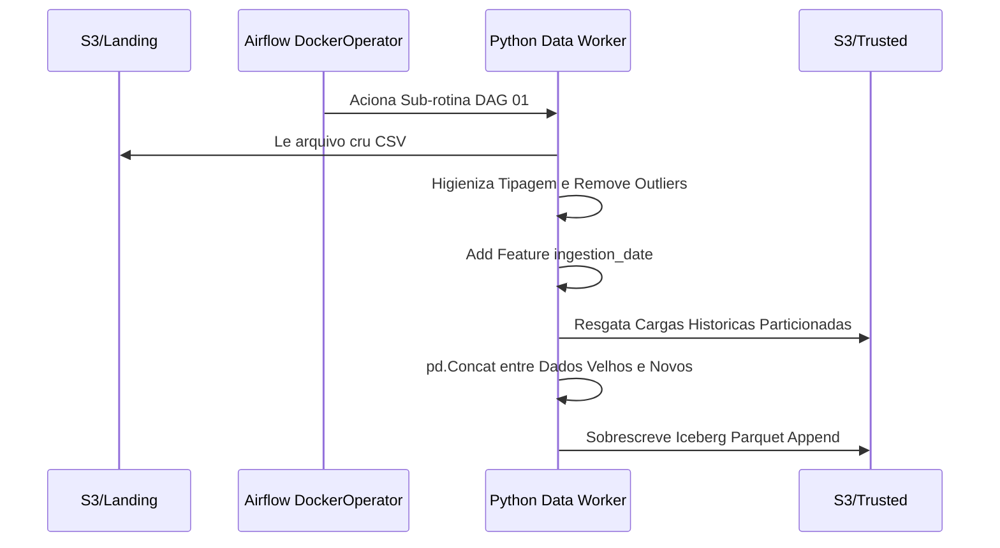
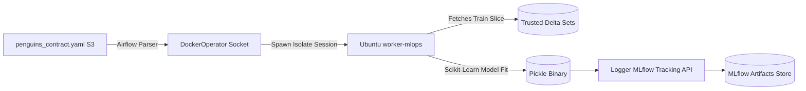
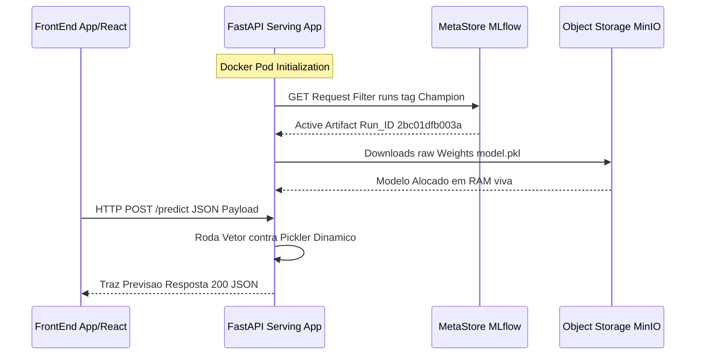
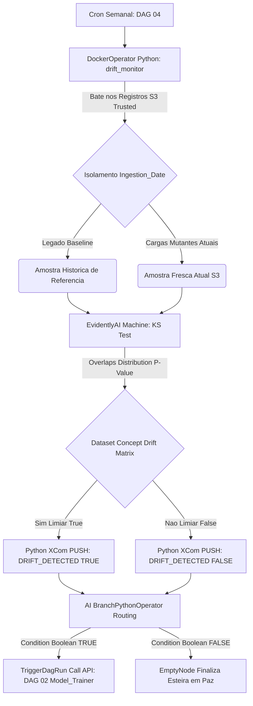

# MLOps Platform (End-to-End)

Plataforma de Machine Learning Operations, projetada em arquitetura de microsserviços, 100% conteinerizada (Docker), orientada a Data Contracts (YAML) com sistemas de Data/Concept Drift.

---

## Como Iniciar a Aplicacao (Bootstrapping)

A arquitetura foi inteiramente orquestrada via Docker Compose nativo em Linux. Para subir o laboratório isolado na sua máquina sem instalar nenhuma dependência sistêmica fora do Docker Engine:

1. Clone o repositório e navegue até o diretório da Pipeline:
```bash
git clone https://github.com/engfelipeviana/machine_Learning_pipeline.git
cd machine_Learning_pipeline
```

2. Inicialize a Infraestrutura e Automatize o Boot (Recomendado via Makefile):
O repositório possui um `Makefile` configurado para automatizar builds local de workers Airflow DinD, inicializar o banco e logar automaticamente. No terminal da raiz, execute apenas:
```bash
make start
```
*Isso irá construir internamente as Imagens Master, subir a Nuvem (Comando equivalente a `docker compose up -d`) e, após 15 segundos de aquecimento, **abrirá automaticamente todas as URLs abaixo no seu navegador padrão de abas!***

Caso prefira o uso fragmentado para gerência manual, o `Makefile` oferece comandos individuais:
- `make build`: Efetua apenas a construção das imagens.
- `make up`: Apenas sobe os containers silenciados do ecossistema.
- `make down`: Desliga ordenamente todo o cluster containerizado.
- `make clean`: Destrói todo o cluster e limpa rigorosamente volumes residuais.

3. Endpoints Essenciais (Abertos na Tela pelo "make open-browsers"):
- Apache Airflow (Orquestrador UI): http://localhost:8088 (admin / admin)
- MinIO S3 (Data Lake Console): http://localhost:9001 (minioadmin / minioadmin)
- MLflow (Model Registry): http://localhost:5000
- FastAPI (Inference Swagger UI): http://localhost:8000/docs
- Trino / JupyterLab: http://localhost:8888

---

## Execução Prática: Treinamento, Serving e API

### 1. Como Executar o Treinamento do Modelo
O treinamento ocorre de modo versionado e isolado, através do Apache Airflow e ambientes orquestrados DinD.
Dependência: para o treinamento ocorrer é necessário que a DAG 01 tenha sido executada com sucesso e que exista dados na camada Trusted do Data Lake. O contrato com os metadados deve estar de acordo com o arquivo contract.yaml, exemplo -> penguins_contract.yaml

1. Acesse a interface do Airflow: **http://localhost:8088** `(usuário: admin / senha: admin)`
2. No painel de DAGs, localize e ative a rotina **`DAG 02: Model Trainer`**.
3. Clique no botão de Play (Trigger DAG) para iniciar.
4. O processo identifica as regras e treina o modelo Scikit-Learn automaticamente, registrando os binários no MLflow como nossa versão **Champion** do momento.
5. (Opcional) Acompanhe o ciclo de vida do seu modelo no [MLflow](http://localhost:5000).

### 2. Como Servir o Modelo Treinado
A API em FastAPI é responsável pelo serving do modelo. O serviço recupera em memória RAM o modelo associado ao alias `@Champion` no momento da subida do container.
Para provisionar a infraestrutura e já subir o modelo para inferência:
```bash
# Inicie o container
docker compose up -d mlops-api
```
*(Nota: Se houver um novo modelo treinado na Airflow DAG 02, pode ser necessário aplicar um force reload para a API carregar as variáveis atualizadas para a RAM: `docker compose restart mlops-api`)*.

### 3. Requisições na API e Swagger
Existem duas formas de interagir com o modelo provido:

**A. Usando o Swagger UI (Testes Locais):**
1. Acesse: **http://localhost:8000/docs**
2. Expanda a documentação da rota `POST /predict`.
3. Clique no botão **"Try it out"**.
4. Preencha o formulário HTML com os dados exigidos (`ilha`, `bico_comp_mm`, etc).
5. Pressione "Execute" e aguarde o retorno da classe predita do pinguim em formato JSON.

**B. Script HTTP cURL (Integração e Automação):**
Se preferir, ou para debugar em background, encaminhe os dados estritamente via protocolo Form-Encoded:
```bash
curl -X 'POST' \
  'http://localhost:8000/predict' \
  -H 'accept: application/json' \
  -H 'Content-Type: application/x-www-form-urlencoded' \
  -d 'ilha=torgersen&bico_comp_mm=39.1&bico_largura_mm=18.7&nadadeira_comp_mm=181.0&masso_corporal_g=3750.0&sexo=macho'
```
*A resposta conterá a espécia prevista.*

---

## Arquitetura Macro da Solucao

O ecossistema divide-se em Ingestão Medallion, Orquestracao Docker-in-Docker (DinD), Registro Científico Controlado e Consumo API de Baixa Latência. A Máquina Airflow lidera a auto-manutenção da Inteligência Artificial.


---

## Componentes da Arquitetura em Detalhes

### 1. Data Engineering (Pipeline ELT Medallion)
A ingestão de dados atua sobre o modelo de camadas lógicas (Medallion Architecture) persistindo DataFrames físicos no S3.

- **Fluxo Lógico / Processo ETL (Extract, Transform, Load):**
  - **Extract (Extração):** O arquivo bruto (raw) nesse caso para fins de demostração é feito o upload manual para o bucket da landing zone, sendo recebido e mantido inalterado na Landing Zone do Data Lake estruturado no S3 (MinIO).
  - **Transform (Transformação):** A DAG 01 do Airflow invoca um container Docker puro (Data Worker) que atua sobre o dado bruto. Nesta fase primeiramente a carga dos dados na camada raw eem format parquet (iceberg)
  - **Load (Carga):** Na ultima tarefa ocorrem a higienização, tipagem correta, remoção de outliers e a conversão necessáira, uma coluna sistêmica temporal (`ingestion_date`) é adicionada para garantir a rastreabilidade, temos então a camada Trusted., finalizamos a persistência do DataFrame estruturado fazendo um Delta/Append sobre a camada central governada (Trusted Zone), pronta para consumo. Essa camada tambem pode ser considerada a feature store off line.
- **Norte Estratégico:** Fornecer massas de dados governadas limpas pro time de Dados rodar Feature Engineering e Consultas.



### 2. Contract-Driven ML Training (Orquestracao DinD)
A pipeline cria uma padronização do processo de desenvolvimento, treinamento e versionamento e deploy de modelos de Machine Learning. Todo o Treino é abstraído por Variáveis em um Arquivo Genérico. Todo Treino roda em ambientes efêmeros.

- Fluxo Lógico: A DAG 02 do Airflow lê o arquivo penguins_contract.yaml. O processo chama o Docker do Servidor e sobe a imagem worker-mlops. Variáveis do Contrato sao injetadas. Ele treina o Modelo utilizando o framework sklearn com Pipeline local e aciona o client nativo do MLflow. O binário Pickle sobe para o repositório unificado.




### 3. Model Serving (FastAPI Real Time)
A esteira de MLOps continua até a exposição do modelo como Produto Global para o Ecossistema.

- Fluxo Lógico: Um Servidor FastAPI ao iniciar imediatamente, ele acessa a base de dados do MLflow por API para encontrar os metadados do do modelo com a Tag da versao atual marcada como Champion. O endpoint baixa o os binários do modelo e os artefatos de pre processamento pra dentro da Memória RAM. 




### 4. Observabilidade Data Drift

- Fluxo Lógico: A DAG 04 executa o EvidentlyAI. comparando as distribuições estatísticas das variáveis entre o dataset de referência (base histórica) e o dataset de entrada (dados recentes). As métricas Kolmogorov-Smirnov cruzam as matrizes e verificam desvios de P-value superior a 0.05. Se anomalias explodem na marca de 50 porcento, flag True é enviada para o XCom. A DAG 04 aciona a DAG de treinamento (DAG 02) e o Airflow Roda Retreinando.


