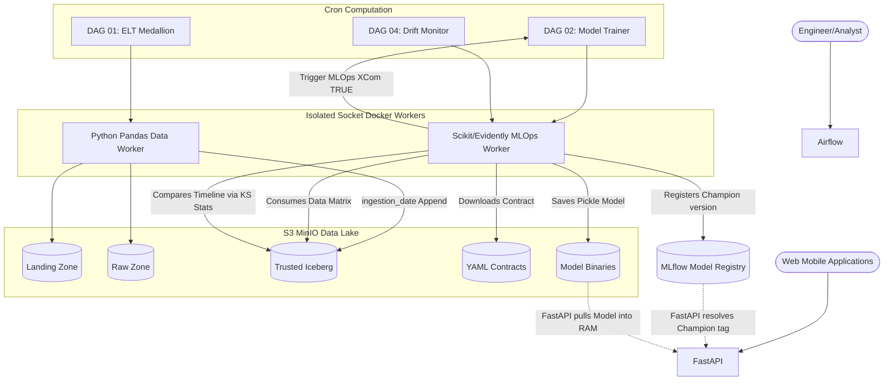
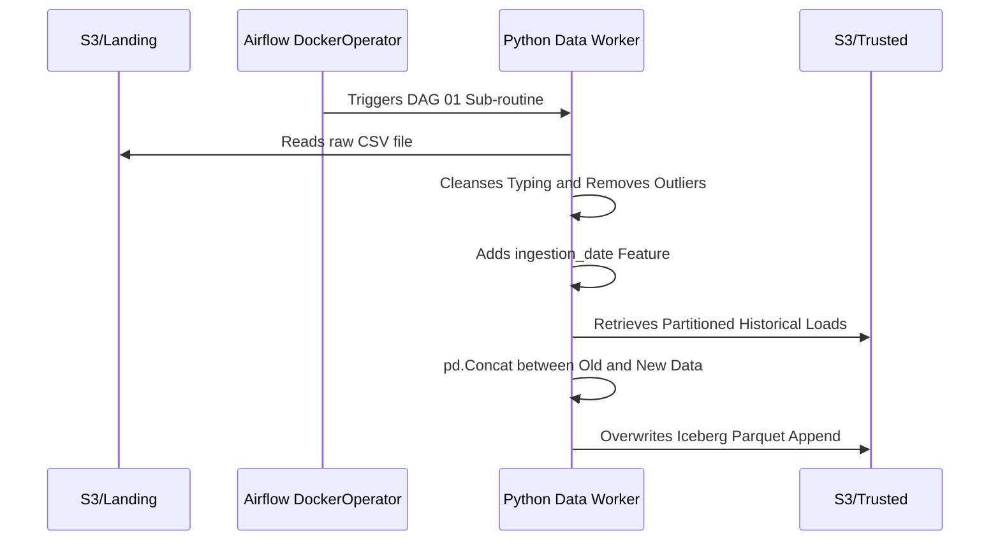
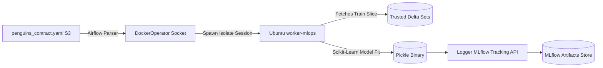
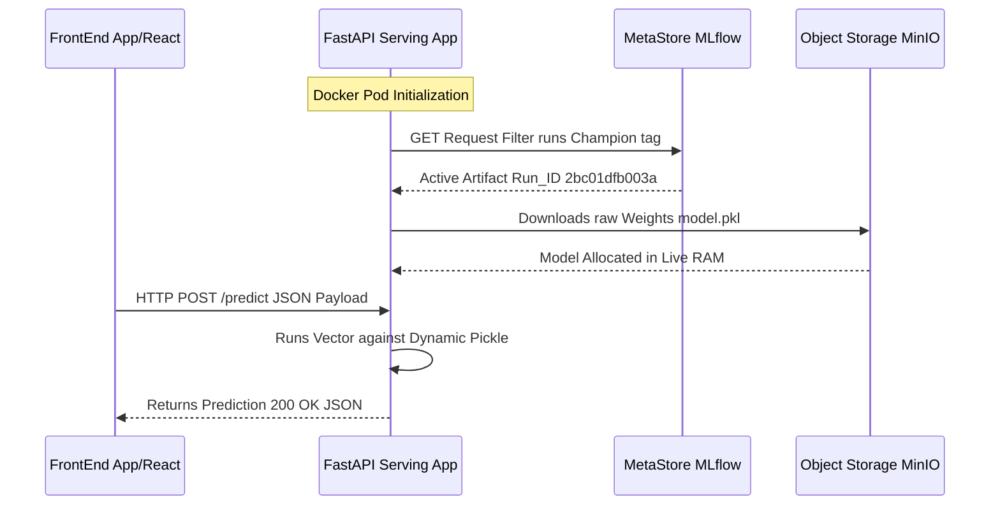
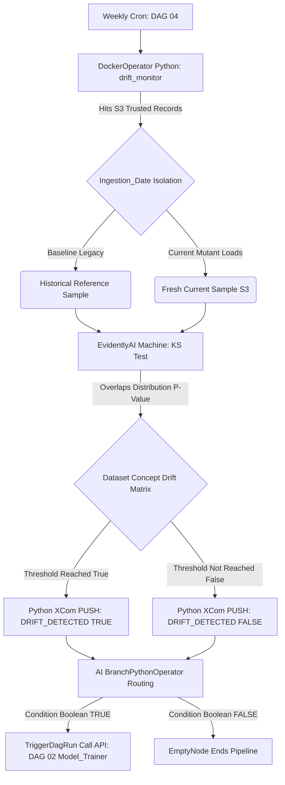
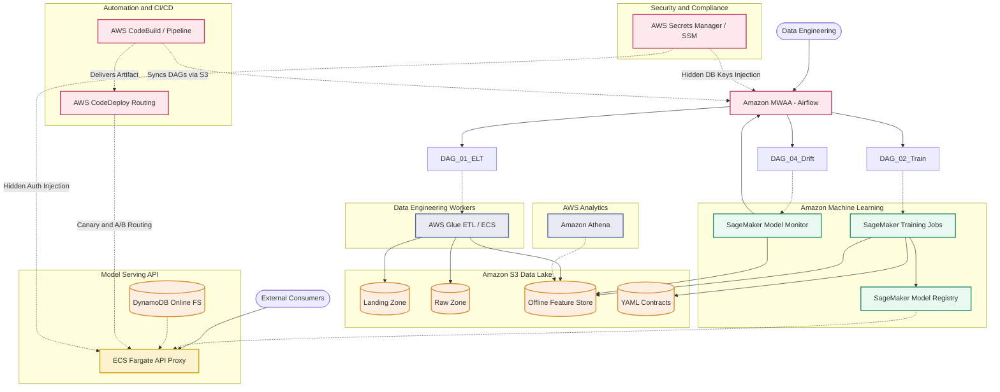

# MLOps Platform (End-to-End)

[🇧🇷 Ver versão em Português (PT-BR)](README.md)

Machine Learning Operations Platform, designed in a microservices architecture, 100% containerized (Docker), driven by Data Contracts (YAML) with Data/Concept Drift systems.

---

## How to Start the Application (Bootstrapping)

The architecture is entirely orchestrated via native Docker Compose on Linux. To spin up the isolated lab on your machine without installing any system dependencies other than Docker Engine:

1. Clone the repository and navigate to the Pipeline directory:
```bash
git clone https://github.com/engfelipeviana/machine_Learning_pipeline.git
cd machine_Learning_pipeline
```

2. Initialize the Infrastructure and Automate the Boot (Recommended via Makefile):
The repository has a `Makefile` configured to automate local builds of Airflow DinD workers, initialize the database, and log in automatically. In the root terminal, simply run:
```bash
make start
```
*This will internally build the Master Images, spin up the Cloud (Command equivalent to `docker compose up -d`) and, after a 15-second warm-up, **will automatically open all the URLs below in your default browser!***

If you prefer fragmented use for manual management, the `Makefile` offers individual commands:
- `make build`: Only performs the image builds.
- `make up`: Only spins up the silenced containers of the ecosystem.
- `make down`: Gracefully shuts down the entire containerized cluster.
- `make clean`: Destroys the entire cluster and rigorously cleans residual volumes.

3. Essential Endpoints (Opened on Screen by "make open-browsers"):
- Apache Airflow (Orchestrator UI): http://localhost:8088 (admin / admin)
- MinIO S3 (Data Lake Console): http://localhost:9001 (minioadmin / minioadmin)
- MLflow (Model Registry): http://localhost:5000
- FastAPI (Inference Swagger UI): http://localhost:8000/docs
- JupyterLab: http://localhost:8888
- Trino: http://localhost:8081 (admin)

---

## Practical Execution: Training, Serving, and API

### 1. How to Run Model Training
Training occurs in a versioned and isolated manner, through Apache Airflow and DinD orchestrated environments.
Dependency: for training to occur, DAG 01 must have been executed successfully, and there must be data in the Trusted layer of the Data Lake. The metadata contract must comply with the contract.yaml file, example -> penguins_contract.yaml

1. Access the Airflow interface: **http://localhost:8088** `(user: admin / password: admin)`
2. In the DAGs panel, locate and activate the routine **`DAG 02: Model Trainer`**.
3. Click the Play button (Trigger DAG) to start.
4. The process identifies the rules and automatically trains the Scikit-Learn model, registering the binaries in MLflow as our current **Champion** version.
5. (Optional) Track your model's lifecycle in [MLflow](http://localhost:5000).

### 2. How to Serve the Trained Model
The FastAPI API is responsible for serving the model. The service retrieves the model associated with the `@Champion` alias into RAM upon container startup.
To provision the infrastructure and spin up the model for inference:
```bash
# Start the container
docker compose up -d mlops-api
```
*(Note: Check the Hot Reload section at the end of this document to learn how to inject the new weights into the API's memory using the shortcut `make reload-api` without having to fetch containers manually)*.

### 3. API Requests and Swagger
There are two ways to interact with the provided model:

**A. Using Swagger UI (Local Testing):**
1. Access: **http://localhost:8000/docs**
2. Expand the documentation for the `POST /predict` route.
3. Click the **"Try it out"** button.
4. Fill the JSON dictionary (Request Body) with the required data (`ilha`, `bico_comp_mm`, etc.).
5. Press "Execute" and wait for the returned predicted class of the penguin in JSON format.

**B. HTTP cURL Script (Integration and Automation):**
If you prefer, or for background debugging, forward the data strictly via JSON payload:
```bash
curl -X 'POST' \
  'http://localhost:8000/predict' \
  -H 'accept: application/json' \
  -H 'Content-Type: application/json' \
  -d '{
  "ilha": "torgersen",
  "bico_comp_mm": 39.1,
  "bico_largura_mm": 18.7,
  "nadadeira_comp_mm": 181.0,
  "masso_corporal_g": 3750.0,
  "sexo": "macho"
}'
```
*The response will contain the predicted species.*

### 4. Data Simulation and Concept Drift Testing
To support local practical tests, files have been made available in the auxiliary folders **`sample_data/`** and **`template_contract/`**.
- The `template_contract/` directory stores the base metadata structure required by the DinD Orchestration training variables (such as `penguins_contract.yaml`).
- **Gold Data Ingestion (Baseline):** Remember, the entire cycle depends on the data being populated. The first step is to process and load the non-drifted file `penguins.csv` by uploading it to the **Landing Zone** bucket.
- **Forcing a Concept Drift (Degradation):** To generate a drift and test "DAG 04 (Drift Monitor)" acting on it:
  1. Copy the drifted data package `penguins drift.csv` from the `sample_data/` folder.
  2. **Structurally rename it back to `penguins.csv`**.
  3. Upload it to the Landing Zone bucket, process it by executing DAG 01.
  4. When the EvidentlyAI KS validators run, they will identify the anomaly and trigger the retraining!

### 5. Connecting to MinIO via Jupyter Extension (S3 Browser)

To explore the MinIO buckets directly through the visual interface of JupyterLab, you can use the **S3 Object Storage Browser** extension (cloud icon on the left sidebar).

Fill in the connection settings as follows:

* **Endpoint URL:** `http://minio:9000`
* **Access Key ID:** `minioadmin`
* **Secret Access Key:** `minioadmin`
* **(Optional) Session Token:** *(leave blank)*

Click **Connect** to view your buckets.

> [!NOTE]
> **Understanding MinIO Ports:**
> Depending on what you want to access, there are two different ports configured in the architecture:
> * **Port 9000 $\rightarrow$ API (S3):** Used by code, SDKs (`boto3`), clients (`mc`), and integrations between applications (like the S3 Browser Jupyter extension). In the Docker internal network, the address is `http://minio:9000`, and on your local machine, it is `http://localhost:9000`.
> * **Port 9001 $\rightarrow$ Web Console (Graphical Interface):** Used to access the MinIO administrative dashboard directly in your browser. Example: `http://localhost:9001`.

---

## Macro Solution Architecture

The ecosystem is divided into Medallion Ingestion, Docker-in-Docker Orchestration (DinD), Controlled Scientific Registry, and Low-Latency API Consumption. The Airflow Machine leads the Artificial Intelligence auto-maintenance.



---

## Architecture Components in Detail

### 1. Data Engineering (Medallion ELT Pipeline)
Data ingestion operates on the logical layering model (Medallion Architecture) persisting physical DataFrames in S3.

- **Logical Flow / ETL Process (Extract, Transform, Load):**
  - **Extract:** The raw file in this case, for demonstration purposes, is manually uploaded to the landing zone bucket, being received and kept unchanged in the Landing Zone of the S3-structured Data Lake (MinIO).
  - **Transform:** Airflow's DAG 01 invokes a pure Docker container (Data Worker) that acts on the raw data. In this phase, the data is first loaded into the raw layer in parquet format (iceberg).
  - **Load:** In the final task, data cleansing, correct typing, outlier removal, and necessary conversion occur; a temporal system column (`ingestion_date`) is added to ensure traceability, creating the Trusted layer. Finally, we persist the structured DataFrame by performing a Delta/Append over the governed central layer (Trusted Zone), ready for consumption. This layer can also be considered the offline feature store.
- **Strategic Goal:** Provide clean, governed data masses for the Data team to run Feature Engineering and Queries.



### 2. Contract-Driven ML Training (DinD Orchestration)
The pipeline standardizes the process of development, training, versioning, and deploying Machine Learning models. All training is abstracted by variables in a Generic File. All training runs in ephemeral environments.

- **Logical Flow:** Airflow's DAG 02 reads the `penguins_contract.yaml` file. The process calls the Server's Docker and spins up the `worker-mlops` image. Contract variables are injected. It trains the Model using the `sklearn` framework with a local Pipeline and triggers the native MLflow client. The Pickle binary is uploaded to the unified repository.



### 3. Model Serving (FastAPI Real Time)
> [!NOTE]
> **API Architecture Disclaimer**: For simplicity and to mitigate friction when spinning up the Docker orchestrator, we opted not to modularize the API scripts (creating folders like `routers/`, `schemas/`, `services/`). However, it should be noted that **in consolidated production environments and proper repositories, this directory structure is the ideal practice** to achieve maintainability and scalability.

The MLOps pipeline continues until the model is exposed as a Global Product for the Ecosystem.

- **Logical Flow:** Upon starting, a FastAPI Server immediately accesses the MLflow database via API to find the metadata of the model with the Tag of the current version marked as Champion. The endpoint downloads the model binaries and preprocessing artifacts into RAM.

---

### Hot Reload of New Models (Simulated Deploy)

**There is a High-Performance protection (Singleton pattern) active in the FastAPI's `lifespan` cycle.**
The API server **locks the physical classifier into RAM** the moment it starts up. We do this to guarantee a fast response rate (`< 1ms` I/O on the machine) and to spare excessive requests against S3 and MLflow with each new client *request*.

As a consequence of this retention, when **DAG 02** of Airflow runs again and elects a new model, **the API becomes outdated because it will not immediately pull this update**.

To perform the deploy applying a "Zero-Downtime Deploy", use the Makefile directly:
```bash
make reload-api
```
*(This strictly forces an atomic restart of only the `fastapi-server` resource, triggering the native Lifespan boot and absorbing your new Champion Pickle model in seconds).*

---



### 4. Data Drift Observability

- **Logical Flow:** DAG 04 executes EvidentlyAI, comparing the statistical distributions of the variables between the reference dataset (historical baseline) and the input dataset (recent data). Kolmogorov-Smirnov metrics cross the matrices and check for P-value deviations greater than 0.05. If anomalies spike at the 50 percent mark, a True flag is sent to XCom. DAG 04 triggers the training DAG (DAG 02) and Airflow runs the Retraining.



---

## AWS Architecture Mapping

The 100% containerized architecture of this MLOps project transitions perfectly to a highly scalable set of **Amazon Web Services (AWS)** infrastructure components:

- **Storage and Data Lake:** The role executed locally by MinIO is an almost literal abstraction (using the same API) of **Amazon S3**.
- **Data Processing (ELT):** The ephemeral containers with Pandas are perfectly represented by instantiating jobs in **AWS Glue** or directly in **AWS ECS / Fargate**.
- **System Orchestration:** All scheduling engineering based on Apache Airflow migrates seamlessly to the corresponding managed service: **Amazon MWAA**.
- **Machine Learning and Drift:** The modeling and registration pipeline via MLflow migrates to training layers focused on **Amazon SageMaker** (Training Jobs and Model Registry). The stochastic drift test comes to life serverless in **SageMaker Model Monitor**.
- **FastAPI / Global Serving:** The model inference endpoint runs directly on **ECS Fargate** behind the API Gateway, and for extreme latency reduction (Features Enrichment in ms), **Amazon DynamoDB** coupled via SageMaker is used acting agilely as an *Online Feature Store*.
- **SQL Engine:** Heavy, distributed ANSI requests executed by Trino find engine compatibility (Serverless) in **Amazon Athena**.
- **Serverless Integration (CI/CD):** Rebuilding tool and container images migrates natively from manual execution (like *Make*) to automated pipelines in **AWS CodePipeline** combined with **AWS CodeBuild**.
- **Advanced Deployment (Canary and A/B Tests):** Releasing Champion versions without downtime utilizes weight routing (e.g., 10% traffic to Challenger, 90% to Champion) managed by **AWS CodeDeploy** natively injected into API Gateway & Fargate, or via the *Endpoint Variants* routing itself if serving the closed MLOps version directly on **Amazon SageMaker Endpoints**.
- **Vaults and Credentials Security:** Sensitive passwords, S3 keys, and variables (`.env`) would gain encryption. Their reads would be automatically injected into machines and microservices via **AWS Secrets Manager** or using **AWS Systems Manager (SSM Parameter Store)**.

